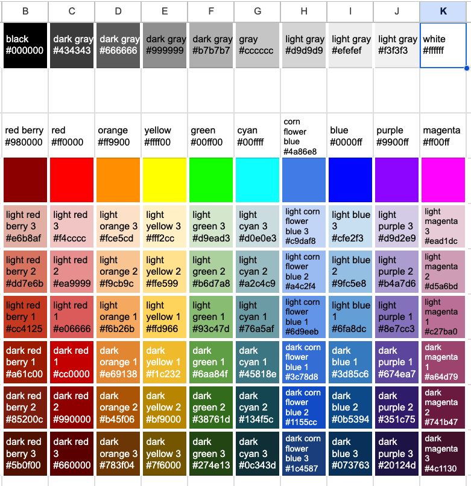
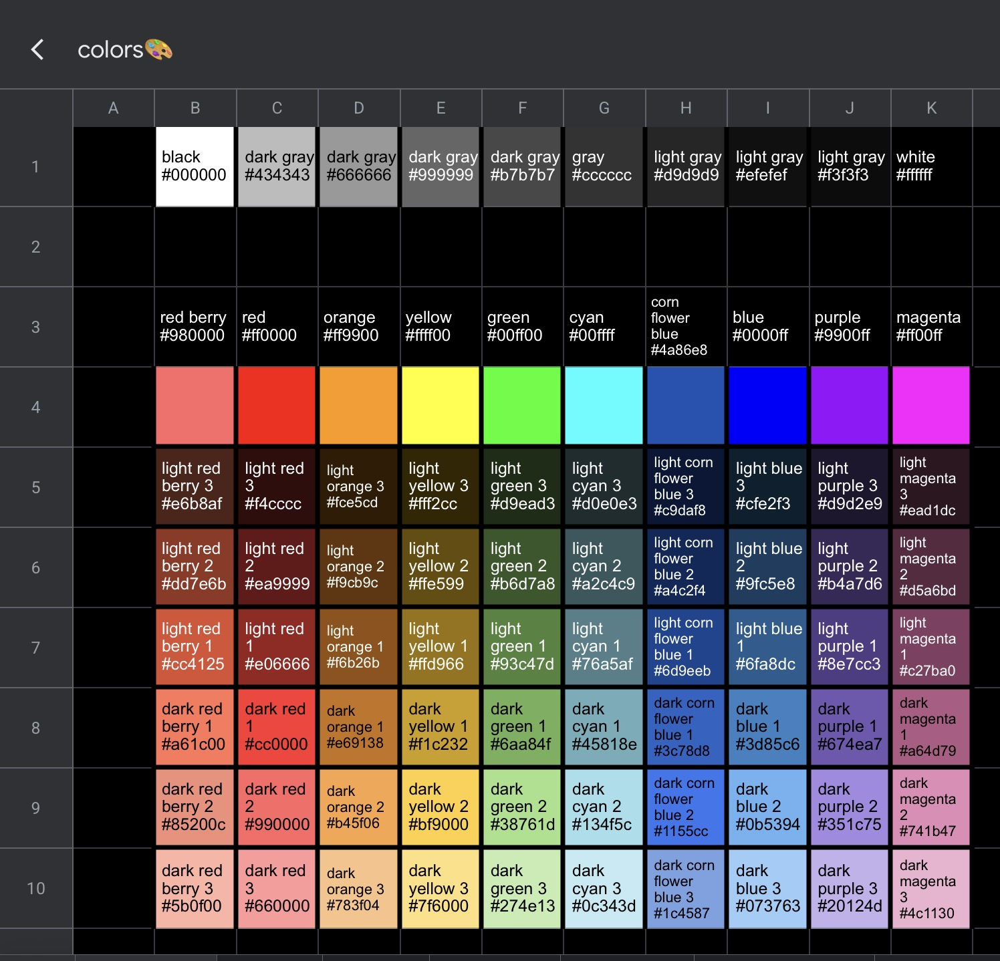

# google-sheet-colors
hex values of google docs/sheets colors. Adapted from <https://spreadsheet.dev/how-to-get-the-hexadecimal-codes-of-colors-in-google-sheets>

## Formulae used

- `=substitute($M12," ", " "&index(split(C$4,char(10)&"#",false),1,1)&" ")&CHAR(10)&BG_HEX(C6)`
- `=let(BG_HEX, lambda(cell, BGHEXCURRENT(row(cell),column(cell)))`
- `=let(parts,split(B1,char(10)), hex, index(parts,1,2), name, index(parts,1,1), "const COLOR_"&upper(substitute(name," ","_"))&" = """&hex&"""")`
- `=join(char(10),vstack(TOCOL(N3:W3), tocol(TRANSPOSE(N4:W10))))`
- `=let(parts,split(B1,char(10)), hex, index(parts,1,2), name, index(parts,1,1), """"&substitute(name," ","_")&""": """&hex&""",")`
- `="const COLORS="&join(char(10)&"  ",vstack("{",TOCOL(N3:W3), tocol(TRANSPOSE(N4:W10))))&char(10)&"}"`
- `=let(parts,split(B1,char(10)), hex, index(parts,1,2), name, index(parts,1,1), "--"&substitute(name," ","-")&": "&hex&";")`
- `=":root "&join(char(10)&"    ",vstack("{",TOCOL(N3:W3), tocol(TRANSPOSE(N4:W10))))&char(10)&"}"`
- `=let(parts,split(B20,char(10)), hex, index(parts,1,2), name, index(parts,1,1), name)`
- `= join(char(10),BYROW(VSTACK(N2:W2,N2:W2,N4:W10), lambda(x_,join("|",hstack("",x_,"") ))))`
-   ```
      =let(parts,split(B1,char(10)), hex, index(parts,1,2), name, substitute(index(parts,1,1)," ","-"), name&" `"&hex&"`"&$S$1&HEX2RGB(hex)&$V$1 )
    ```

## Display

|red berry|red|orange|yellow|green|cyan|corn flower blue|blue|purple|magenta|
|-|-|-|-|-|-|-|-|-|-|
|$`{\Huge \color[RGB]{152,0,0}\blacksquare\blacksquare}`$|$`{\Huge \color[RGB]{255,0,0}\blacksquare\blacksquare}`$|$`{\Huge \color[RGB]{255,153,0}\blacksquare\blacksquare}`$|$`{\Huge \color[RGB]{255,255,0}\blacksquare\blacksquare}`$|$`{\Huge \color[RGB]{0,255,0}\blacksquare\blacksquare}`$|$`{\Huge \color[RGB]{0,255,255}\blacksquare\blacksquare}`$|$`{\Huge \color[RGB]{74,134,232}\blacksquare\blacksquare}`$|$`{\Huge \color[RGB]{0,0,255}\blacksquare\blacksquare}`$|$`{\Huge \color[RGB]{153,0,255}\blacksquare\blacksquare}`$|$`{\Huge \color[RGB]{255,0,255}\blacksquare\blacksquare}`$|
|$`{\Huge \color[RGB]{230,184,175}\blacksquare\blacksquare}`$|$`{\Huge \color[RGB]{244,204,204}\blacksquare\blacksquare}`$|$`{\Huge \color[RGB]{252,229,205}\blacksquare\blacksquare}`$|$`{\Huge \color[RGB]{255,242,204}\blacksquare\blacksquare}`$|$`{\Huge \color[RGB]{217,234,211}\blacksquare\blacksquare}`$|$`{\Huge \color[RGB]{208,224,227}\blacksquare\blacksquare}`$|$`{\Huge \color[RGB]{201,218,248}\blacksquare\blacksquare}`$|$`{\Huge \color[RGB]{207,226,243}\blacksquare\blacksquare}`$|$`{\Huge \color[RGB]{217,210,233}\blacksquare\blacksquare}`$|$`{\Huge \color[RGB]{234,209,220}\blacksquare\blacksquare}`$|
|$`{\Huge \color[RGB]{221,126,107}\blacksquare\blacksquare}`$|$`{\Huge \color[RGB]{234,153,153}\blacksquare\blacksquare}`$|$`{\Huge \color[RGB]{249,203,156}\blacksquare\blacksquare}`$|$`{\Huge \color[RGB]{255,229,153}\blacksquare\blacksquare}`$|$`{\Huge \color[RGB]{182,215,168}\blacksquare\blacksquare}`$|$`{\Huge \color[RGB]{162,196,201}\blacksquare\blacksquare}`$|$`{\Huge \color[RGB]{164,194,244}\blacksquare\blacksquare}`$|$`{\Huge \color[RGB]{159,197,232}\blacksquare\blacksquare}`$|$`{\Huge \color[RGB]{180,167,214}\blacksquare\blacksquare}`$|$`{\Huge \color[RGB]{213,166,189}\blacksquare\blacksquare}`$|
|$`{\Huge \color[RGB]{204,65,37}\blacksquare\blacksquare}`$|$`{\Huge \color[RGB]{224,102,102}\blacksquare\blacksquare}`$|$`{\Huge \color[RGB]{246,178,107}\blacksquare\blacksquare}`$|$`{\Huge \color[RGB]{255,217,102}\blacksquare\blacksquare}`$|$`{\Huge \color[RGB]{147,196,125}\blacksquare\blacksquare}`$|$`{\Huge \color[RGB]{118,165,175}\blacksquare\blacksquare}`$|$`{\Huge \color[RGB]{109,158,235}\blacksquare\blacksquare}`$|$`{\Huge \color[RGB]{111,168,220}\blacksquare\blacksquare}`$|$`{\Huge \color[RGB]{142,124,195}\blacksquare\blacksquare}`$|$`{\Huge \color[RGB]{194,123,160}\blacksquare\blacksquare}`$|
|$`{\Huge \color[RGB]{166,28,0}\blacksquare\blacksquare}`$|$`{\Huge \color[RGB]{204,0,0}\blacksquare\blacksquare}`$|$`{\Huge \color[RGB]{230,145,56}\blacksquare\blacksquare}`$|$`{\Huge \color[RGB]{241,194,50}\blacksquare\blacksquare}`$|$`{\Huge \color[RGB]{106,168,79}\blacksquare\blacksquare}`$|$`{\Huge \color[RGB]{69,129,142}\blacksquare\blacksquare}`$|$`{\Huge \color[RGB]{60,120,216}\blacksquare\blacksquare}`$|$`{\Huge \color[RGB]{61,133,198}\blacksquare\blacksquare}`$|$`{\Huge \color[RGB]{103,78,167}\blacksquare\blacksquare}`$|$`{\Huge \color[RGB]{166,77,121}\blacksquare\blacksquare}`$|
|$`{\Huge \color[RGB]{133,32,12}\blacksquare\blacksquare}`$|$`{\Huge \color[RGB]{153,0,0}\blacksquare\blacksquare}`$|$`{\Huge \color[RGB]{180,95,6}\blacksquare\blacksquare}`$|$`{\Huge \color[RGB]{191,144,0}\blacksquare\blacksquare}`$|$`{\Huge \color[RGB]{56,118,29}\blacksquare\blacksquare}`$|$`{\Huge \color[RGB]{19,79,92}\blacksquare\blacksquare}`$|$`{\Huge \color[RGB]{17,85,204}\blacksquare\blacksquare}`$|$`{\Huge \color[RGB]{11,83,148}\blacksquare\blacksquare}`$|$`{\Huge \color[RGB]{53,28,117}\blacksquare\blacksquare}`$|$`{\Huge \color[RGB]{116,27,71}\blacksquare\blacksquare}`$|
|$`{\Huge \color[RGB]{91,15,0}\blacksquare\blacksquare}`$|$`{\Huge \color[RGB]{102,0,0}\blacksquare\blacksquare}`$|$`{\Huge \color[RGB]{120,63,4}\blacksquare\blacksquare}`$|$`{\Huge \color[RGB]{127,96,0}\blacksquare\blacksquare}`$|$`{\Huge \color[RGB]{39,78,19}\blacksquare\blacksquare}`$|$`{\Huge \color[RGB]{12,52,61}\blacksquare\blacksquare}`$|$`{\Huge \color[RGB]{28,69,135}\blacksquare\blacksquare}`$|$`{\Huge \color[RGB]{7,55,99}\blacksquare\blacksquare}`$|$`{\Huge \color[RGB]{32,18,77}\blacksquare\blacksquare}`$|$`{\Huge \color[RGB]{76,17,48}\blacksquare\blacksquare}`$|
|||||||||||||
|black|||||gray||||white|
|$`{\Huge \color[RGB]{0,0,0}\blacksquare\blacksquare}`$|$`{\Huge \color[RGB]{67,67,67}\blacksquare\blacksquare}`$|$`{\Huge \color[RGB]{102,102,102}\blacksquare\blacksquare}`$|$`{\Huge \color[RGB]{153,153,153}\blacksquare\blacksquare}`$|$`{\Huge \color[RGB]{183,183,183}\blacksquare\blacksquare}`$|$`{\Huge \color[RGB]{204,204,204}\blacksquare\blacksquare}`$|$`{\Huge \color[RGB]{217,217,217}\blacksquare\blacksquare}`$|$`{\Huge \color[RGB]{239,239,239}\blacksquare\blacksquare}`$|$`{\Huge \color[RGB]{243,243,243}\blacksquare\blacksquare}`$|$`{\Huge \color[RGB]{255,255,255}\blacksquare\blacksquare}`$|


see code or [this issue](/../../issues/2) for hex values

### Light Mode


### Dark Mode


